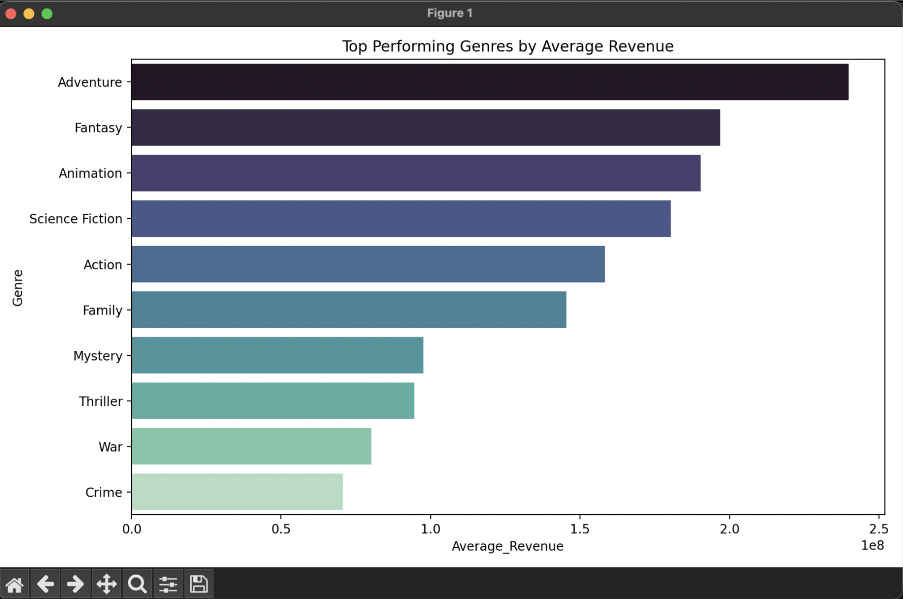
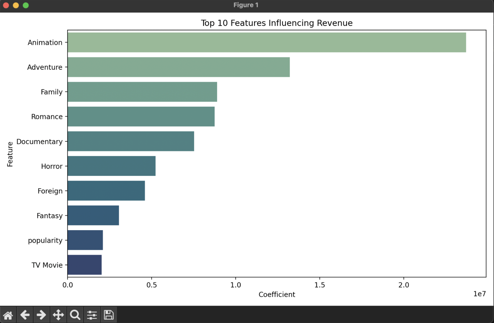
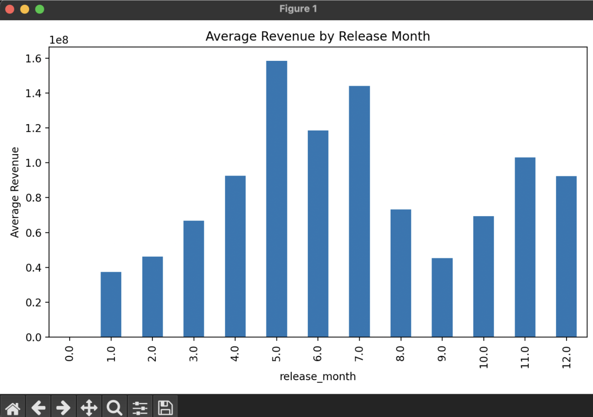
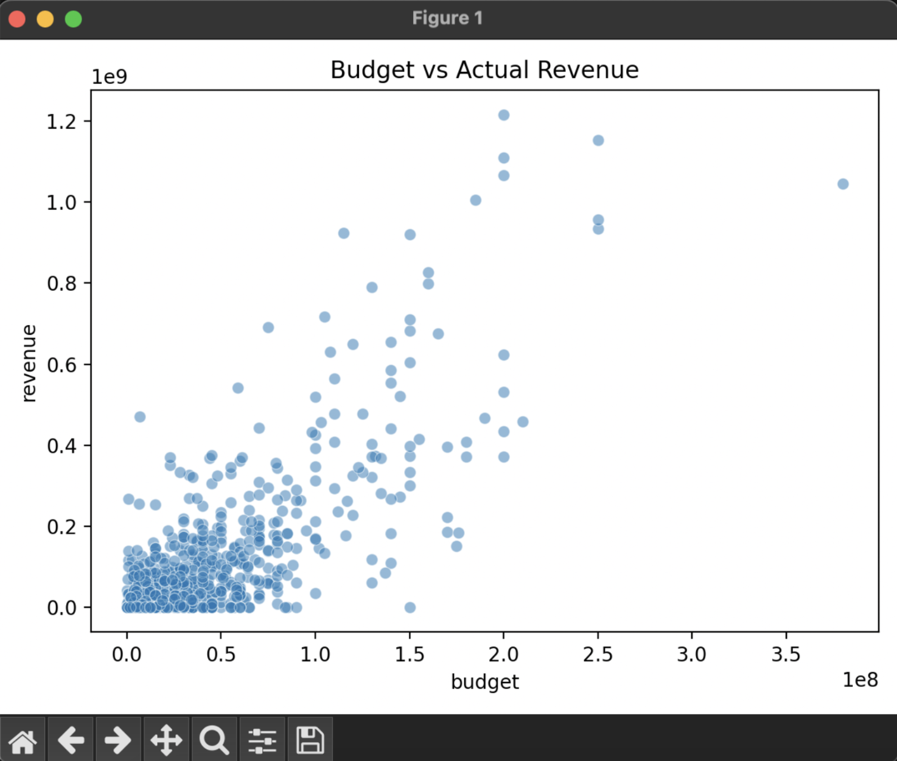
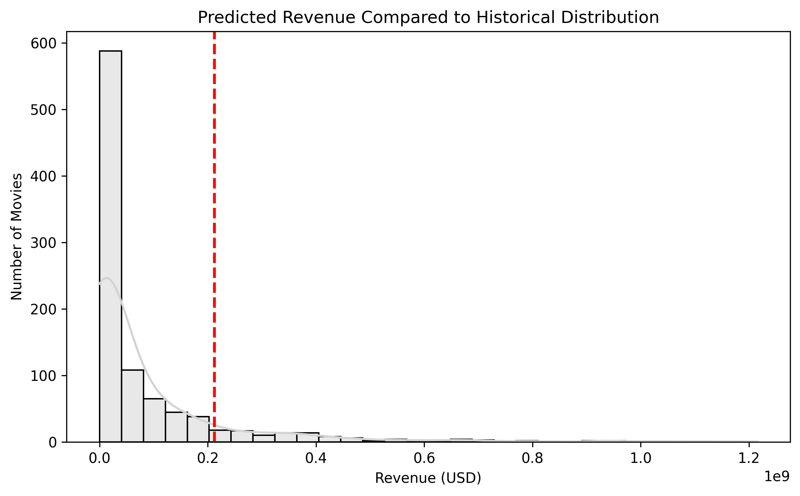
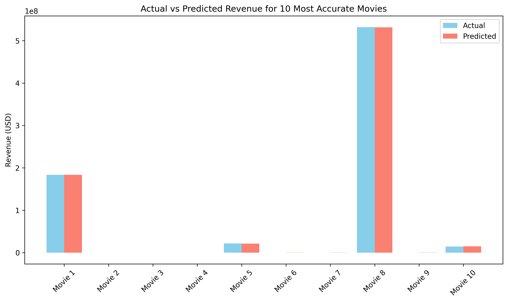
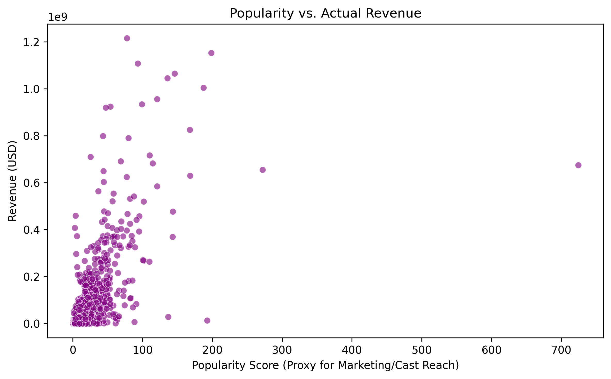

# 🎬 Movie Box Office Prediction
A machine learning model that predicts movie revenue based on pre-release data (budget, genre, popularity, etc.) using the TMDB 5000 dataset.

## Features
- Data preprocessing with pandas and numpy  
- Linear regression model (scikit-learn)  
- Insights on genre trends, budget relationships, and seasonal effects  
- Visualization using matplotlib and seaborn  

## Setup
- Create a virtual environment:
```bash
python3 -m venv venv_boxoffice
source venv_boxoffice/bin/activate
```

```bash
pip install -r requirements.txt
python insights_analysis.py
```

## 📊 Dataset

The data used in this project comes from the **TMDB 5000 Movie Dataset**, available on Kaggle:  
🔗 [TMDB 5000 Movie Dataset on Kaggle](https://www.kaggle.com/datasets/tmdb/tmdb-movie-metadata)

This dataset includes:
- Movie budget, revenue, runtime, and popularity  
- Cast and crew metadata  
- Genres and release dates  

Only **pre-release features** were used for prediction (e.g., budget, genre, popularity, release month) to simulate realistic forecasting before a movie’s release.

Open for Future Improvements
## 📊 Key Insights

1️⃣ **Top Performing Genres** – Adventure, Fantasy, and Animation films achieve the highest average revenues.  
These genres show strong audience appeal and franchise potential.  


---

2️⃣ **Budget vs. Revenue** – Higher budgets generally produce higher returns but with diminishing gains at extremes.  
This shows that while investment matters, marketing and story also influence success.  


---

3️⃣ **Seasonal Trends** – Summer and holiday releases (May–July, Nov–Dec) dominate box-office performance.  
These periods coincide with school breaks and holiday viewing spikes.  


---

4️⃣ **Feature Importance** – Genres and popularity are strong positive predictors of revenue.  
The regression coefficients highlight which features drive box-office earnings the most.  


---

5️⃣ **Predictive Benchmarking** – The model can estimate expected revenue for new films before release.  
The red line shows how a hypothetical film’s forecast compares to historical performance.  


---

6️⃣ **Comparison Analysis** – Actual vs. predicted results show consistent accuracy for most films.  
This helps identify where the model succeeds and where unique cases (e.g., viral hits) deviate.  


---

7️⃣ **Marketing & Casting Impact** – Popularity (a proxy for pre-release buzz or cast fame) strongly correlates with earnings.  
Movies with stronger marketing reach or popular casts tend to generate higher revenue.  

